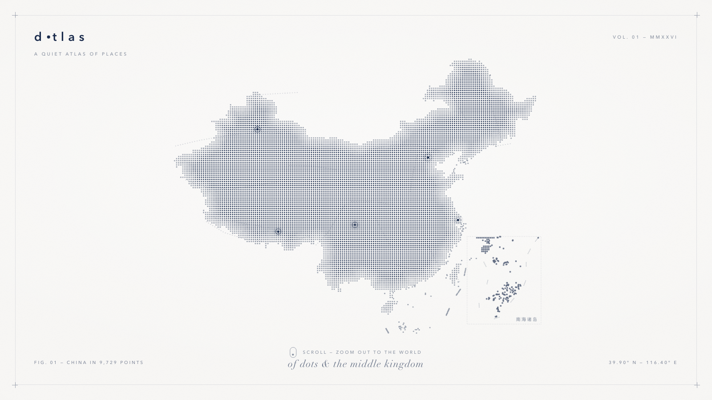
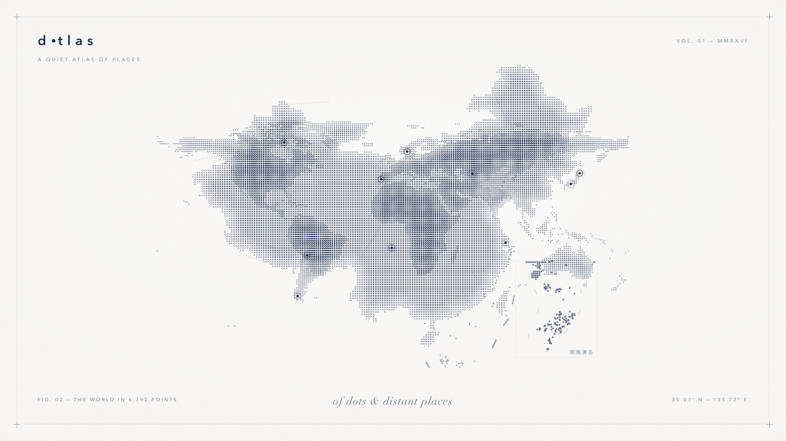

# dotlas

**一方安静的地理志 —— 极简点阵地图相册。**

`dotlas` 是一个生成式设计概念：用真实海岸线数据绘制的点画（stipple）风格地图，
四周环绕着悬浮的拍立得照片卡片。高级极简主义、杂志式排版、安静的画廊气质。
没有图片素材、没有依赖库、查看时也无需构建 —— 只有一个自包含的 HTML 文件，
在任何分辨率下都保持清晰。




## 设计概念

- **中国地图优先** —— 页面打开时首先呈现一幅独立绘制的中国版点阵地图（占舞台过半
  宽度）：陆地掩膜来自国界数据（含台湾、海南及南海诸岛，附经典"南海诸岛"附图，
  附图内绘有十段断续线），山脉（喜马拉雅、天山、昆仑、太行、大兴安岭……）以
  若隐若现的细点线勾勒，北京、上海、成都、拉萨、乌鲁木齐五处脉冲圆环点缀其上。
  **鼠标悬停任一省份，该省点阵会明显上浮**——点色统一转为深藏青并带奶油色
  描边光圈，再叠加柔和投影。每个省份是独立的 SVG 图层，上浮动画由合成器
  直接驱动（不重绘点阵）；省界命中区置于**静止覆盖层**，边缘悬停绝不抖动。
  图注、坐标（北京经纬度）与衬线副题均随之切换。
- **滚轮缩放过渡** —— 向下滚动滚轮（或双指捏合、垂直拖拽），中国地图逐渐
  缩小淡出，世界地图缓缓放大浮现，照片卡片与五处世界地点圆环随后回归；
  反向滚动则回到中国。过渡由 `requestAnimationFrame` 驱动，停手后自动
  吸附到最近一端，并遵循 `prefers-reduced-motion`。
- **点阵地图** —— 数千个正圆点从 Natural Earth 海岸线数据中采样而来。所有圆点
  等大、严格对齐方形点阵；颜色由到海岸线（或国界）的距离决定 —— 边缘是
  柔灰色圆点，向内陆平滑加深为深海军蓝（`#1A2B4C`）。没有任何随机抖动、
  点径起伏与连线 —— 大陆以纯粹的点矩阵方式成形，山脉则以叠加其上的
  细点线（`ridgeLineSvg`）轻轻带过。
- **照片卡片**（暂未启用，`src/content.mjs` 中 `CARDS_ENABLED` 一键恢复）—— 五张
  极简拍立得悬浮于地图之上，带柔和弥散的多层阴影与缓慢的漂浮动效。抽象的
  风景剪影、地点与日期的图注，以及安静的脉冲圆环，把每段记忆钉在地图上的
  某一点。
- **纸张氛围** —— 暖奶油色（`#F9F8F6`）底面叠加分形噪点纸纹、轻微暗角、
  极细边框与瑞士风格对位十字，排版字体全部使用系统字体栈。

## 快速开始

用任意现代浏览器打开 [`index.html`](index.html) 即可 —— 这就是全部设计。
页面以 16:9 舞台自适应任意视口：进入时是中国地图，滚动滚轮向外缩小到世界，
滚动回来则回到中国。

## 从源码构建

```bash
npm run build     # 重新生成 index.html（Node >= 18，零依赖）
npm run preview   # 可选：渲染 docs/preview-china.png 与 docs/preview.png（Python 3 + Pillow）
```

构建是完全确定性的：点阵由距离场逐点决定，不含任何随机成分，保证每次运行生成
同一张地图。构建过程还会在终端打印一幅 ASCII 世界地图和圆点统计信息。

## 工作原理

1. **解码** —— 世界图：将 `data/land-110m.json`（Natural Earth 110m 陆地，
   由 [world-atlas](https://github.com/topojson/world-atlas) 打包为 TopoJSON）
   解码为海岸线环。中国图：解析 `data/china.json`（阿里云 DataV 国界 GeoJSON，
   含 277 个环）为国界环，做标准纬线 35°N 的等距圆柱投影，窗口
   73°E–135.5°E / 15.5°N–54.5°N。
2. **光栅化** —— 先把跨 180° 经线的环沿换日线切割（`splitAntimeridianRings`，
   避免斐济、弗兰格尔岛等地物被拉成横贯全图的幻影带），再用扫描线填充把环
   绘制为陆地掩膜（世界图 500 格宽，中国图 1400 格宽）（`src/geometry.mjs`）。
3. **距离场** —— 计算到最近海岸线 / 国界的 chamfer 距离变换，作为唯一的点径
   调制场；山脉折线不参与点径，由 `ridgeLineSvg` 直接绘成细点线。
4. **点阵采样** —— 在严格对齐、居中的方形点阵上逐格采样（`src/stipple.mjs`）；
   陆地格点落下等大圆点（`sizeRatio` 控制点径），颜色由海岸距离场从柔灰到
   藏青平滑渐变，海面格点留空，无随机抖动、无随机取舍。小于点阵间距的岛屿
   由连通域 / 小环两级保底机制保证至少落下一个点。南海诸岛附图独立采样，
   小岛礁同样保底。
5. **组装与交互** —— 圆点按颜色分桶为成组的 SVG `<circle>` 元素，与标记圆环、
   照片卡片一起注入页面模板（`src/template.mjs`）；内联脚本以滚轮 / 捏合 /
   拖拽驱动 `z ∈ [0,1]` 的连续插值，完成双地图交叉淡变与文案切换。中国版
   逐点做点在多边形判定后，**每个省份输出为独立 SVG 图层**（含简化省界
   透明命中区），悬停上浮由合成器动画驱动，性能与点数无关。

## 定制指南

你可能想调整的内容，每类集中在一个文件里：

| 想修改的内容              | 位置                                                    |
| ------------------------- | ------------------------------------------------------- |
| 照片卡片、图注、地点      | `src/content.mjs` —— `CARDS`、`PLACES`                  |
| 重新启用照片卡片          | `src/content.mjs` —— `CARDS_ENABLED = true`             |
| 中国版标记城市            | `src/content.mjs` —— `CHINA_PLACES`                     |
| 地图上的山脉              | `src/content.mjs` —— `RIDGES` / `CHINA_RIDGES`          |
| 圆点间距、配色            | `src/stipple.mjs` —— `DOT_SPACING`、`GREY`、`NAVY`     |
| 中国图圆点密度            | `src/china.mjs` —— `CHINA_DOTS`                         |
| 世界地图范围 / 投影裁切   | `src/geometry.mjs` —— `LAT_TOP`、`LAT_BOT`              |
| 中国图窗口 / 附图范围     | `src/china.mjs` —— `CHINA_WINDOW`、`INSET`              |
| 布局、字体、纹理、交互    | `src/template.mjs`                                      |

## 项目结构

```text
dotlas/
├── index.html            # 设计成品（生成物，提交入库以便直接查看）
├── package.json          # npm 脚本：build、preview
├── data/
│   ├── land-110m.json    # Natural Earth 110m 陆地 TopoJSON（公有领域）
│   ├── china.json        # 阿里云 DataV 中华人民共和国国界 GeoJSON
│   └── china-provinces.json # DataV 省级边界（含十段断续线要素 100000_JD）
├── src/
│   ├── generate.mjs      # 构建入口：世界 + 中国两条流水线
│   ├── geometry.mjs      # 投影、光栅化、距离场（通用网格原语）
│   ├── stipple.mjs       # 点阵采样、配色、地图 SVG 图层
│   ├── china.mjs         # 中国版点阵地图 + 南海诸岛附图
│   ├── content.mjs       # 卡片、地点、山脉（手写内容数据）
│   └── template.mjs      # HTML/CSS 页面模板 + 缩放交互脚本
├── scripts/
│   └── preview.py        # 快速 PIL 构图预览 → docs/preview*.png
├── docs/
│   ├── screenshot-china.png  # 初始视图（中国地图）
│   ├── screenshot.png        # 世界视图（index.html 的浏览器渲染）
│   ├── preview-china.png     # 中国视图构图预览
│   └── preview.png           # 世界视图构图预览
└── build/                # 中间产物（已 gitignore）
```

## 数据与致谢

- 海岸线几何数据：[Natural Earth](https://www.naturalearthdata.com/)
  （公有领域），由 [world-atlas](https://github.com/topojson/world-atlas) 打包。
- 中国国界数据：[阿里云 DataV.GeoAtlas](https://datav.aliyun.com/portal/school/atlas/area_selector)
  `100000.json`（中华人民共和国全域）与 `100000_full.json`（34 省级边界，另含
  `100000_JD` 十段断续线要素，已绘制于南海诸岛附图及台湾东侧）。
- 排版使用系统字体栈（衬线：Didot / Bodoni / Georgia；无衬线：
  Avenir Next / Helvetica Neue）—— 无需安装或打包任何字体。
